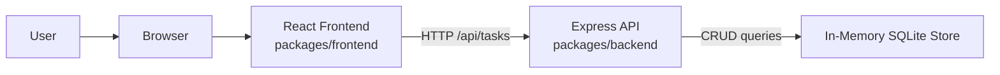
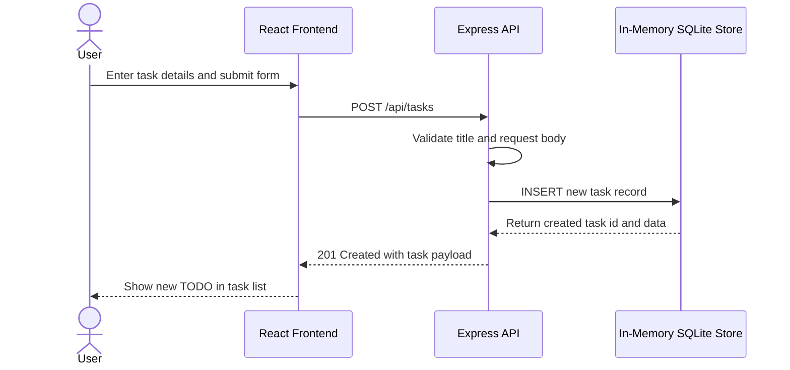

# Cloud Architecture Overview

This monorepo contains a simple full-stack TODO application with a React frontend and an Express API. The frontend runs in the browser, sends HTTP requests to the backend, and the backend stores task data in an in-memory SQLite database.

## System Context

## Create TODO Sequence

## Notes

- The frontend and backend are developed in a single npm workspace monorepo.
- The API is implemented with Express and exposes task endpoints under `/api/tasks`.
- The current data store is in-memory, so task data does not persist across backend restarts.